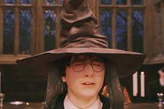

# DSLR



Data Science X Logistic Regression - Harry Potter and a Data Scientist

This is a 42 AI project to create an AI that assigns Harry Potter dormitories using student data sets. First, preprocess the given data in an appropriate way. Next, visualize it through histograms and scatter plots and decide which features to select to train the AI. Lastly, AI is developed through Logistic regression.

## Requirements

- Python version 3.10.13

## Installation

```python
pip install -r requirements.txt
```

## How to run

```terminal
python 01.describe.py dataset_train.csv
python 02.histogram.py dataset_train.csv
python 03.scatter_plot.py dataset_train.csv
python 04.pair_plot.py dataset_train.csv
python 05.logreg_train.py dataset_train.csv
python 06.logreg_predict.py dataset_test.csv weights.csv
python 07.evaluate.py
```

## Bonus

- describe.py: add more fields like pandas.describe. `count`, `unique`, `top`, `freq`
- Multiple graph & info: histogram, scatter_plot
- Mini-Batch
- Stochastic
- Train loss graph for each algorithms

## Resources

- [Supervised Machine Learning: Regression and Classification](https://www.coursera.org/learn/machine-learning?specialization=machine-learning-introduction)
- [Batch, Mini Batch & Stochastic Gradient Descent](https://towardsdatascience.com/batch-mini-batch-stochastic-gradient-descent-7a62ecba642a)
